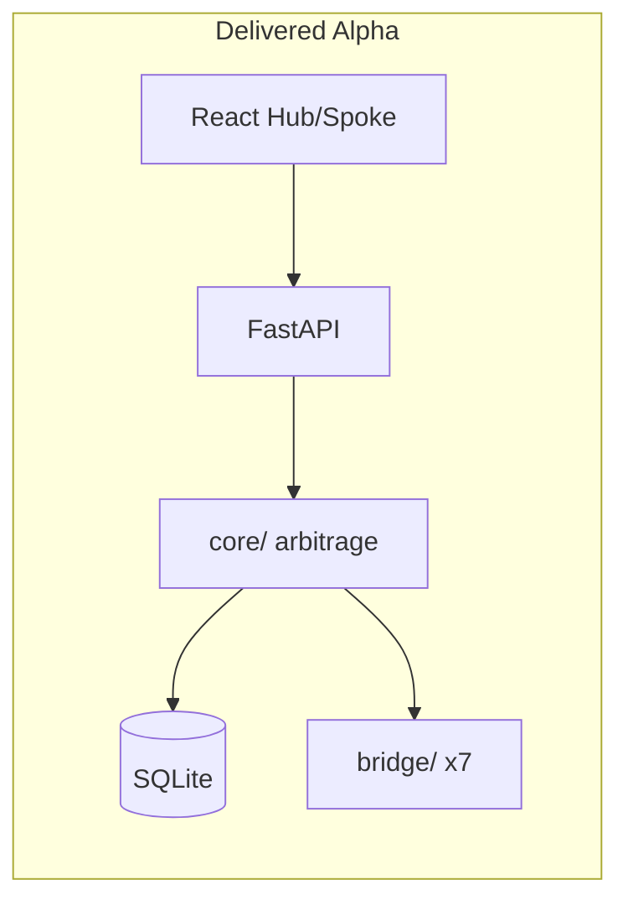

# BAIC Alpha Implementation — Completion Report

**Date:** 2026-06-05 · **Baseline:** 0.1.1 · **Status:** Complete

---

## Executive summary

Full **TokenMaxxing Control Plane** Alpha delivered: modular SQLite backend, FastAPI arbitrage core, seven provider bridges, React Hub-and-Spoke UI, unified `run_baic.py` / `test_baic.py` entry points, lint-clean Python, **22/22 tests passing**, documentation with Mermaid diagrams and MERIT hyperlinks.

---

## Deliverables checklist

| Item | Status | Location |
|------|--------|----------|
| Operations entry | ✓ | `run_baic.py` |
| Test entry | ✓ | `test_baic.py` |
| Modular DB port | ✓ | `db/ports.py`, `db/sqlite_backend.py` |
| eNAT ORM + seed | ✓ | `db/models.py`, `db/seed.py` |
| Provider registry | ✓ | `cfg/provider_registry.json` |
| 7 bridges | ✓ | `bridge/google`, `azure`, `aws`, `oci`, `cursor`, `github_copilot`, `google_one` |
| FastAPI | ✓ | `core/api/app.py` |
| Hub + Spoke UI | ✓ | `web/` → `web/dist/` |
| Unit tests | ✓ | 16 tests |
| Integration tests | ✓ | 6 API tests |
| Ruff lint | ✓ | All checks passed |
| UI build | ✓ | Vite production build |
| CONCEPTS_GUIDE | ✓ | `BAIC docs/CONCEPTS_GUIDE.md` |
| TECHNICAL HLD/LLD | ✓ | `BAIC docs/TECHNICAL_HLD_LLD.md` |
| USER_GUIDE | ✓ | `BAIC docs/USER_GUIDE.md` |
| INDEX + AGENTS | ✓ | `BAIC docs/INDEX.md`, `AGENTS.md` |

---

## Test results

```
22 passed in ~1.8s
ruff: All checks passed!
web: vite build succeeded
```

Run: `python test_baic.py`

---

## How to run

```powershell
python run_baic.py --no-browser
# → http://127.0.0.1:8765/
```

---

## Architecture (summary diagram)



---

## Known Alpha limitations

- Proxy `forward_request` is stubbed (no live Google/Azure API calls)  
- Admin UI is API-only (`/api/v1/admin/providers`) — JSON edit for now  
- WebSocket metrics stream planned; Hub polls every 30s  
- PostgreSQL backend stubbed via `DatabasePort` — SQLite only implemented  

---

## WebHostingPad deployment notes

- Python 3.11+ with FastAPI + uvicorn  
- SQLite path `output/baic_state.db` — ensure `output/` writable  
- Pre-build UI locally: `cd web && npm run build` — serve via FastAPI static mount  
- Same modular DB swap when host provides PostgreSQL  

---

## Documentation index

Start at [INDEX.md](INDEX.md).

---

## Sign-off

Implementation complete per approved scope. No blocking issues. Ready for Human Bala review and `merit.ps1 mXin` closeout.
