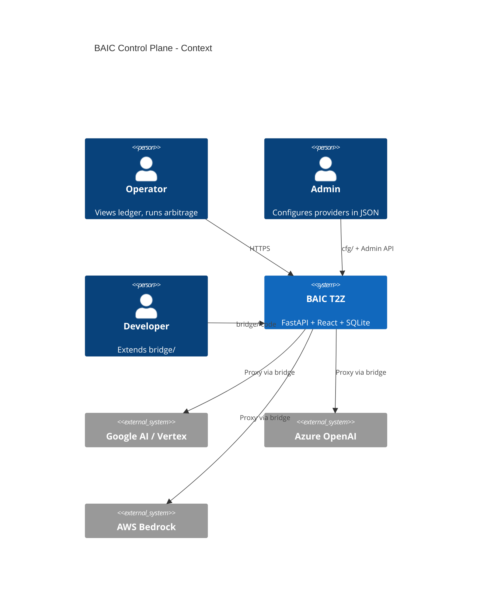
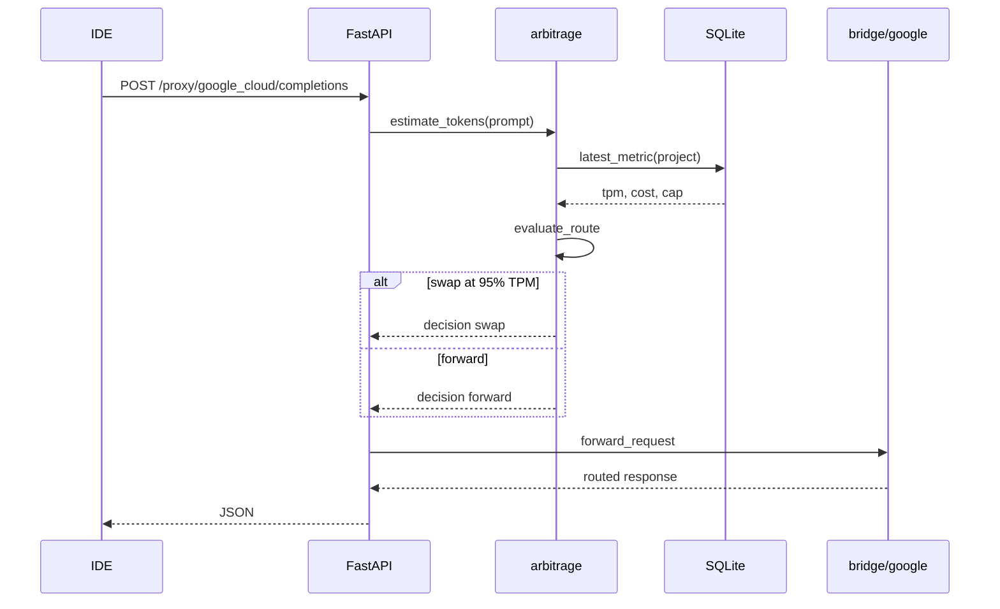
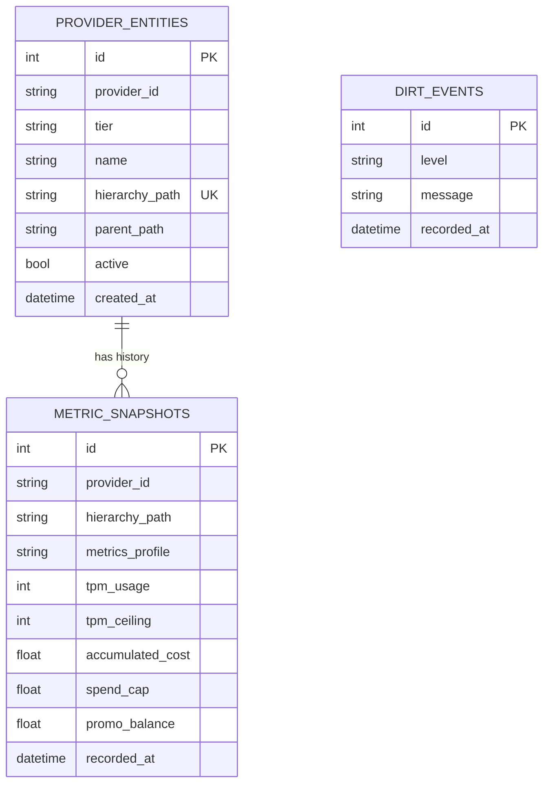

# BAIC Technical HLD / LLD

Architecture reference with diagrams. Product requirements: [BAIC_PRD.md](input/BAIC_PRD.md). Concepts: [CONCEPTS_GUIDE.md](CONCEPTS_GUIDE.md).

---

## 1. System context (OID)



---

## 2. Container diagram

```mermaid
flowchart TB
  subgraph UI["web/ React + Tailwind + Recharts"]
    HUB[Global Ledger Hub]
    SPOKE[Provider Console]
  end
  subgraph API["core/api FastAPI"]
    R1[/hub/summary]
    R2[/providers/id/console]
    R3[/proxy/id/completions]
  end
  subgraph CORE["core/"]
    HS[hub_service]
    ARB[arbitrage]
    PL[provider_loader]
  end
  subgraph DBL["db/ modular"]
    PORT[DatabasePort]
    SQL[SQLiteBackend]
    REPO[EnatRepository]
  end
  subgraph BR["bridge/"]
    G[google]
    AZ[azure]
    OTH[aws, oci, cursor, ...]
  end
  CFG[(cfg/*.json)]
  SQLITE[(output/baic_state.db)]

  HUB --> R1
  SPOKE --> R2
  R1 --> HS
  R2 --> HS
  R3 --> ARB
  HS --> PL
  HS --> REPO
  PL --> BR
  PL --> CFG
  REPO --> PORT
  PORT --> SQL
  SQL --> SQLITE
  ARB --> PL
```

---

## 3. Request flow (proxy path)



---

## 4. ER diagram (eNAT)



---

## 5. Modular database layer

| Layer | File | Responsibility |
|-------|------|----------------|
| Port | `db/ports.py` | Abstract `DatabasePort` |
| SQLite | `db/sqlite_backend.py` | Local file DB (default) |
| Models | `db/models.py` | SQLAlchemy ORM |
| Repository | `db/repository.py` | Query API for services |
| Factory | `create_database()` in sqlite_backend | Select engine from cfg |

**Migration path:** set `cfg/config.json` → `"engine": "postgres"` and implement `PostgresBackend(DatabasePort)` — `core/hub_service.py` unchanged.

**WebHostingPad:** SQLite file under `output/baic_state.db` requires writable `output/` — same pattern as local dev.

---

## 6. API reference

| Method | Path | Description |
|--------|------|-------------|
| GET | `/api/v1/health` | Health + DB status |
| GET | `/api/v1/hub/summary` | Global Ledger payload |
| GET | `/api/v1/providers/{id}/console` | Spoke console |
| POST | `/api/v1/providers/{id}/operations/{op}` | UI CTA handler |
| POST | `/api/v1/proxy/{id}/completions` | Inference proxy |
| GET | `/api/v1/admin/providers` | Registry + loaded ids |

Static UI: `/` when `web/dist/` exists (built).

---

## 7. Test harness

| Suite | File | Count |
|-------|------|-------|
| Unit | `tests/test_*.py` | path, config, db, bridge, arbitrage |
| Integration | `tests/test_api_integration.py` | FastAPI TestClient |
| Runner | `python test_baic.py` | wraps pytest |

**Last run:** 22 passed · ruff clean.

---

## 8. Persona × capability matrix

| Capability | User | Admin | Developer |
|------------|:----:|:-----:|:---------:|
| View Hub / Spoke | ✓ | ✓ | ✓ |
| Trigger CTAs | ✓ | ✓ | ✓ |
| Edit provider_registry.json | | ✓ | ✓ |
| Add bridge module | | | ✓ |
| Change DB backend | | | ✓ |
| Run test_baic.py | | ✓ | ✓ |

---

## 9. Directory map

```
BAIC/
├── run_baic.py          # Operations entry
├── test_baic.py         # Test entry
├── core/                # hub_service, arbitrage, api, provider_loader
├── db/                  # Modular persistence
├── bridge/<provider>/   # Vendor adapters
├── cfg/                 # SSOT JSON
├── web/                 # React UI → dist/
├── tests/               # pytest
└── BAIC docs/           # This file + guides (MERIT {Name} docs/)
```

See [INDEX.md](INDEX.md) for navigation.
