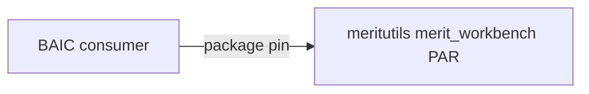

# BAIC — Low-Level Design Map (LLD_MAP)

**Document ID:** BAI-IAR-LLD-001  
**Repo:** `AgentDraven/BAIC`  
**Design SSOT:** `BAIC docs/baic_design.md` (when present) · **IAR:** [MERITUTILS_WORKBENCH.md](MERITUTILS_WORKBENCH.md)

| Field | Value |
|-------|-------|
| **MERIT role** | **Consumer** (foundation certified) |
| **Providers** | meritutils `merit_workbench` (ACK in IAR) |

---

<a id="purpose"></a>
## 1. Purpose & scope ^purpose

LLD map for BAIC — business AI console consumer: web UI, core logic, cfg, merit_workbench integration.

---

<a id="ascii-tree"></a>
## 2. ASCII tree ^ascii-tree

```
BAIC/
├── core/                   # Domain logic
├── web/                    # Web application shell
├── bridge/                 # External integrations
├── cfg/                    # JSON_CFG bundles
├── db/                     # Persistence layer
├── scripts/ ops/ tests/
├── BAIC docs/IAR/
└── output/
```

---

<a id="folder-rationalization"></a>
## 3. Folder rationalization ^folder-rationalization

| Path | Role |
|------|------|
| `core/` | BAIC domain services, orchestration |
| `web/` | Operator-facing UI |
| `bridge/` | LLM / external API adapters |
| `cfg/` | Product configuration intent |
| `db/` | Schema + data access |
| `BAIC docs/IAR/MERITUTILS_WORKBENCH.md` | merit_workbench consumer IAR |
| `BAIC docs/IAR/MERITUTILS_ENV.md` | Env composition for meritutils |

---

<a id="interlock"></a>
## 4. Interlock diagram ^interlock



---

<a id="api-catalog"></a>
## 5. Integration catalog ^api-catalog

```yaml
merit_workbench PAR:
  iar: BAIC docs/IAR/MERITUTILS_WORKBENCH.md
  delivery: package from pkg-meritutils.vercel.app
  adapter: web/ static mount per IAR

MERITUTILS_ENV:
  iar: BAIC docs/IAR/MERITUTILS_ENV.md
  purpose: Document env keys for PAR + optional Python utils
```

---

<a id="peer-maps"></a>
## 6. Peer maps ^peer-maps

| Peer | LLD_MAP |
|------|---------|
| meritutils | [MERITUTILS_LLD_MAP](../../../meritutils/Meritutils%20docs/IAR/MERITUTILS_LLD_MAP.md) |
| DIRT (reference) | [DIRT_LLD_MAP](../../../dirt/DIRT%20docs/IAR/DIRT_LLD_MAP.md) |
| vault | [VAULT_LLD_MAP](../../../merit-private-vault/docs/IAR/VAULT_LLD_MAP.md) |

---

<a id="document-control"></a>
## 7. Document control ^document-control

| Version | Date | Change |
|---------|------|--------|
| 1.0.0 | 2026-06-16 | Initial BAIC_LLD_MAP |
