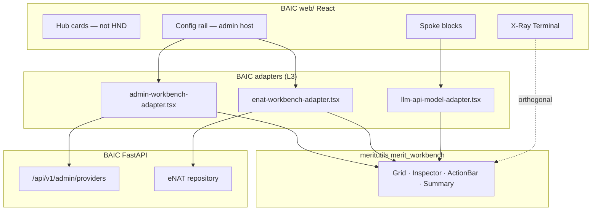

# MERITUTILS ↔ BAIC — `merit_workbench` (IAR)

**Requester:** BAIC (`BAI`) — **consumer / control plane**  
**Provider:** meritutils (`MTU`) — shared UI utility **`merit_workbench`**  
**Policy:** MERIT L1 §0.D IAR Code of Honor · L1 §II.E.1 HND · L1 §II.H X-Ray · L1 §II.J Mobile-First  
**Normative refs:** `merit-private-vault/instructions/MERIT.instructions` §E.1 · DIRT `DIRT docs/IAR/MERIT_HND.md` (reference implementation)

> **Naming:** **HND** = Hand-and-Detail UX pattern (GRID + INSPECTOR + Action Bar). **`merit_workbench`** = meritutils package/module name — **not** `@meritutils/hnd`.

**IDs:** Provider rows **BAI-MTU-01…** · Consumer validation **BAI-MTU-V01…**

---

## EXECUTIVE ACTION NEEDED

**meritutils agent:** Implement **`merit_workbench`** from DIRT `workbench-kit.*` (see DIRT `MERIT_HND.md` §5). BAIC is **blocked** on admin/eNAT HND surfaces until **BAI-MTU-01…08** ACCEPT.

**BAIC agent:** **WAIT** on meritutils — keep React Hub/Spoke cards; integrate `merit_workbench` only after **BAI-MTU-V01** pass. Do not fork grid/inspector DOM in `web/`.

---

## 1. Purpose (PRD summary)

BAIC is the **TokenMaxxing Control Plane** — Hub (portfolio ledger) + Spoke (per-provider console) + Config rail + X-Ray (MERIT §II.H). Today:

| Surface | Today | Target with `merit_workbench` |
|---------|-------|-------------------------------|
| Hub provider cards | React `ProviderCardView` grid | **unchanged** (marketing cards, not HND) |
| Spoke console | Block templates + Recharts | **unchanged** for Alpha; optional model rows later |
| **Admin provider registry** | JSON-only + stub `/api/v1/admin/providers` | **HND workbench** — grid of 11 providers, inspector for hierarchy/secrets |
| **eNAT entity browser** | SQLite only via API | **HND workbench** — billing_account → project → byok rows |
| **LLM API spoke** | `LLM_API_CONSOLE` + model list bind | **HND** — model grid + endpoint inspector |
| **Capability matrix (admin)** | `cfg/model_capability_matrix.json` | **HND readonly** — platform × model grid |
| **DIRT event log** | Hub strip read-only | Optional **readonly HND** in Config rail |

HND lives in the **center column** (admin routes or Spoke sub-panels). X-Ray remains orthogonal (right rail / mobile overlay).

### 1.1 Goals (must-have for BAIC v1 integration)

| ID | Requirement | BAIC evidence / bind point |
|----|-------------|----------------------------|
| BAI-G1 | Sortable searchable grid + checkbox multi-select | Admin provider list from `GET /api/v1/admin/providers` |
| BAI-G2 | Inspector chrome: title, F/◀/▶/L nav, status, body, actions | Provider `display_name`, `hierarchy[]`, `bridge_module`, secrets mask |
| BAI-G3 | MERIT Action Bar (Save · Disable · Archive — tier-gated) | Future `PUT /api/v1/admin/providers/{id}` |
| BAI-G4 | Summary strip with X/Y/Z tooltip semantics | eNAT entity counts per tier |
| BAI-G5 | Readonly mode for capability matrix + DIRT rows | `mode: 'readonly'` |
| BAI-G6 | React adapter or vanilla mount in Config rail | `web/src/components/` — thin wrapper only |
| BAI-G7 | CSS theme hooks match BAIC Tailwind tokens (`baic-*`) | `web/src/index.css` |
| BAI-G8 | Mobile-First: grid full-screen → inspector overlay | `MobileFirstShell` center host |
| BAI-G9 | No subscriber-facing HND acronyms | L1 §E.1 `aboveTheLine` / `belowTheLine` |

### 1.2 Non-goals (BAIC-owned)

- Arbitrage engine, proxy routing, bridge vendor SDK calls
- Hub KPI card layout (not HND)
- Playwright harness (stays in BAIC; contract in §4)

### 1.3 Cross-repo alignment

| Repo | IAR | Package target |
|------|-----|----------------|
| DIRT | `DIRT docs/IAR/MERIT_HND.md` | Reference `workbench-kit.js` → **`merit_workbench`** |
| SomaTune | `SomaTune docs/IAR/MERITUTILS_HND.md` | `@meritutils/workbench` (alias — consolidate to **`merit_workbench`**) |
| meritsubs | `meritsubs docs/IAR/MERITUTILS_HND.md` | ops portal grid |
| **BAIC** | **this doc** | React admin + eNAT browser |

**meritutils SSOT:** one package name **`merit_workbench`** exporting DIRT parity surface (§5.3 in DIRT IAR).

---

## 2. High-level design (HLD)



**Load order (static or Vite):** `merit_workbench` bundle → BAIC adapter → React mount point in Config rail.

---

## 3. Low-level design (LLD) — BAIC bind points

### 3.1 Admin provider grid columns

| Column | Source |
|--------|--------|
| ID | `provider_id` |
| Display | `display_name` |
| Kind | `kind` (`hyperscaler` \| `consumer_frontend` \| `llm_api`) |
| Bridge | `bridge_module` |
| Hierarchy | `hierarchy.join(' → ')` |
| Status | loaded bridge yes/no + secrets configured |

Row id: `provider_id`. Inspector body: JSON pretty-print of registry entry + `secrets_configured` flags (never raw keys).

### 3.2 eNAT entity grid columns

| Column | Source |
|--------|--------|
| Path | `hierarchy_path` |
| Tier | `tier` |
| Name | `name` |
| Provider | `provider_id` |
| Active | `active` |

Inspector: latest `METRIC_SNAPSHOTS` for path (TPM, cost, promo balance per `metrics_profile`).

### 3.3 LLM API model grid (Spoke sub-panel)

From `cfg/provider_registry.json` + `model_capability_matrix.json`:

| Column | Source |
|--------|--------|
| Model | model id |
| Endpoint | `endpoint_key` |
| Available | boolean |
| Pricing ref | `pricing_ref` |

### 3.4 HND id minting (operator rows)

Prefix **`BAI-ADM`** for admin-created eNAT rows (future CRUD):

```javascript
// consumer adapter — after merit_workbench ships mintHnd or rowToHnd
// BAI-ADM-20260608-a3f2
```

---

## 4. Provider acceptance (meritutils agent)

| ID | Criterion | Evidence |
|----|-----------|----------|
| **BAI-MTU-01** | Package **`merit_workbench`** exports DIRT §5.3 parity APIs | `packages/merit_workbench/` + README |
| **BAI-MTU-02** | `renderDataGrid` sort + search + checkbox | unit test |
| **BAI-MTU-03** | `renderInspectorChrome` + F/◀/▶/L selection walk | unit test |
| **BAI-MTU-04** | `renderMeritActionBar` wide/stacked | demo HTML |
| **BAI-MTU-05** | `buildSelectionTooltip` X/Y/Z copy | unit test |
| **BAI-MTU-06** | `readonly` mode (no +New) | demo |
| **BAI-MTU-07** | ESM + global `window.merit_workbench` shim (DIRT compat) | DIRT adapter green |
| **BAI-MTU-08** | CSS vars doc for dark control-plane theme | theme.css |

**Cross-gate:** DIRT MH.7 parity checklist (DIRT IAR §5.3) must pass before BAIC integration.

---

## 5. BAIC consumer validation

| ID | Probe | Pass |
|----|-------|------|
| **BAI-MTU-V01** | Config rail admin tab mounts provider HND; ≥11 rows | pending |
| **BAI-MTU-V02** | Inspector shows hierarchy + masked secrets state | pending |
| **BAI-MTU-V03** | eNAT entity grid lists seed rows; inspector shows metrics | pending |
| **BAI-MTU-V04** | LLM API spoke model grid (groq/openai/gemini/anthropic) | pending |
| **BAI-MTU-V05** | Mobile: grid → inspector overlay | pending |
| **BAI-MTU-V06** | No regression Hub/Spoke without admin tab open | pending |

---

## 6. BAIC tracker

| ID | Item | Owner | Status | Evidence |
|----|------|-------|--------|----------|
| BW.1 | Publish IAR (this doc) | AgentDraven | `[x]` | `BAIC docs/IAR/MERITUTILS_WORKBENCH.md` |
| BW.2 | Document env + llm_api in design/usage | AgentDraven | `[x]` | `baic_design.md` · `baic_usage.md` |
| BW.3 | meritutils **`merit_workbench`** package | meritutils | `[ ]` | BAI-MTU-01…08 |
| BW.4 | BAIC React admin adapter | Priya | `[ ]` | After BW.3 |
| BW.5 | eNAT + LLM API HND panels | Priya | `[ ]` | After BW.4 |
| BW.6 | Consumer validation BAI-MTU-V01…06 | AgentDraven | `[ ]` | After BW.5 |

---

## 7. Escalation

| Date | Issue | Resolution |
|------|-------|------------|
| — | — | No disputes |

---

## Changelog

| Date | Change |
|------|--------|
| 2026-06-08 | Initial IAR — BAIC admin/eNAT/llm_api HND requirements for **`merit_workbench`** |

**Cross-links:** [baic_design.md § merit_workbench](../baic_design.md#merit-workbench) · [MERITUTILS_ENV.md](MERITUTILS_ENV.md) · DIRT [MERIT_HND.md](../../../dirt/DIRT%20docs/IAR/MERIT_HND.md)
