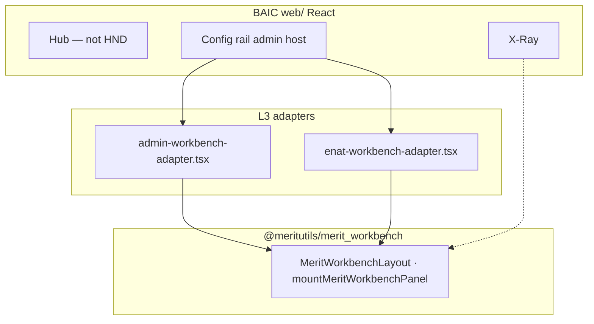

# MERITUTILS ↔ BAIC — `merit_workbench` (IAR)

**Requester:** BAIC (`BAI`) — **consumer / control plane**  
**Provider:** meritutils (`MTU`) — **`@meritutils/merit_workbench`**  
**Policy:** MERIT L1 §0.D IAR Code of Honor · L1 §II.E.1 merit_workbench pattern · L1 §II.H X-Ray · L1 §II.J Mobile-First  
**Normative provider SSOT:** `meritutils/Meritutils docs/IAR/MERIT_WORKBENCH.md` — **review & ACK before BAIC integration**  
**Design SSOT:** `meritutils/Meritutils docs/merit_workbench_design.md`  
**Reference:** DIRT `DIRT docs/IAR/MERIT_HND.md` (reference implementation)

> **Naming:** **HND / merit_workbench pattern** = L1 §II.E.1 (grid + inspector). **`@meritutils/merit_workbench`** = npm package — **not** `@meritutils/hnd`.

**IDs:** Provider gate **MUU-MWB-01…12** (MW.1) · Consumer validation **BAI-MWB-V01…06** · PAR pin **meritutils/merit_workbench@0.3.2**

**PAR SSOT:** DIRT `DIRT docs/IAR/MERIT_HND.md` §0.2 · §0.8 · §11 · vault `cfg/par-registry.json`  
**Delivery:** `https://pkg-meritutils.vercel.app` — **no vendored** `meritutils` bytes in BAIC repo.

**Phase 0:** ACK recorded. **MW-PAR-GATE:** PASS (provider). Consumer stringent audit: **PENDING** until adapters mount from PAR CDN.

---

## 0. PAR consumer lane (merit_workbench)

### 0.1 IAR pin

| Field | Value |
|-------|-------|
| **Pin** | `meritutils/merit_workbench@0.3.2` |
| **CDN base** | `https://pkg-meritutils.vercel.app` (`MERIT_PAR_BASE`) |
| **JS** | `{base}/merit_workbench/0.3.2/merit-workbench.js` |
| **CSS** | `{base}/merit_workbench/0.3.2/merit-workbench.css` |
| **Local SSOT** | `cfg/merit_par_pins.json` |
| **Shell load** | `web/index.html` (SRI from vault `par-registry.json`) |

### 0.2 Stringent audit row (DIRT §0.2 exemplar)

| Provider | Consumer | Capability | PAR load | No copy in consumer? | Verdict |
|----------|----------|------------|----------|----------------------|---------|
| meritutils | **BAIC** | Config rail admin · Spoke model grid (planned) | CDN | **yes** (no `static/vendor/meritutils`) | **PENDING** — shell wired; adapters not mounted |

### 0.3 Tenant adapters (BAIC-owned — no provider bytes)

| Surface | Adapter (planned) | API |
|---------|-------------------|-----|
| Config → Providers | `web/src/adapters/admin-provider-workbench.tsx` | `GET /api/v1/admin/providers` |
| Config → eNAT | `web/src/adapters/enat-workbench.tsx` | `GET /api/v1/admin/entities` (TBD) |
| Spoke → llm_api models | `web/src/adapters/llm-model-workbench.tsx` | platform models API |

Load order: **PAR CDN** (`window.merit_workbench`) → tenant adapter → React mount. **No** npm import of `@meritutils/merit_workbench` in production web build.

---

## EXECUTIVE ACTION NEEDED

**meritutils agent:** **MUU-MWB-01…12 ACCEPT** · **MW-PAR-GATE PASS**. BAIC loads **`merit_workbench`** from PAR CDN only.

**BAIC agent:** PAR shell in `web/index.html` + pin in `cfg/merit_par_pins.json`. Implement tenant adapters (§0.3); run **BAI-MWB-V01…06**; then `meritcert interlock meritutils baic`.

---

## 1. Purpose (PRD summary)

BAIC is the **TokenMaxxing Control Plane** — Hub + Spoke + Config rail + X-Ray (MERIT §II.H).

| Surface | Today | Target with `@meritutils/merit_workbench` |
|---------|-------|-------------------------------------------|
| Hub provider cards | React `ProviderCardView` | **unchanged** (not HND) |
| Spoke console | Block templates + Recharts | **unchanged** Alpha; optional model HND later |
| **Admin provider registry** | stub `/api/v1/admin/providers` | **`MeritWorkbenchLayout`** — 11 providers |
| **eNAT entity browser** | SQLite via API | **`workbench`** — hierarchy rows |
| **LLM API spoke models** | `LLM_API_CONSOLE` bind | **`readonly`** — model grid |
| **Capability matrix (admin)** | JSON SSOT | **`readonly`** |
| **DIRT event log** | Hub strip | optional **`readonly`** in Config rail |

HND in **center column**; X-Ray orthogonal (right rail / mobile overlay).

### 1.1 Consumer requirements (BAI-MWB gate)

| ID | Requirement | Bind point |
|----|-------------|------------|
| BAI-G1 | Sortable searchable grid + checkbox | `GET /api/v1/admin/providers` |
| BAI-G2 | Inspector F/◀/(n/N)/▶/L over selection | registry + masked secrets |
| BAI-G3 | Action bar Save (future admin CRUD) | `PUT /api/v1/admin/providers/{id}` |
| BAI-G4 | Summary strip X/Y/Z (eNAT counts) | optional — see §8 opt-out |
| BAI-G5 | `readonly` for matrix + DIRT rows | `mode: 'readonly'` |
| BAI-G6 | React host: mount via ref + `useEffect` | Config rail — see §9 feedback |
| BAI-G7 | Theme `merit-dark` → BAIC `baic-*` vars | `web/src/index.css` |
| BAI-G8 | Mobile-First stack | `MobileFirstShell` |
| BAI-G9 | No HND acronyms above the line | L1 §E.1 |

### 1.2 Non-goals

- Hub KPI cards, arbitrage, bridge SDK calls, CoC chain (DIRT-owned)

---

## 2. HLD — adapter seam

**Load order:** `merit_workbench` bundle → BAIC adapter → React mount.

---

## 3. LLD — bind points

### 3.1 Admin provider grid

| Column | Source |
|--------|--------|
| ID | `provider_id` |
| Display | `display_name` |
| Kind | `hyperscaler` \| `consumer_frontend` \| `llm_api` |
| Bridge | `bridge_module` |
| Hierarchy | `hierarchy.join(' → ')` |
| Status | bridge loaded + secrets configured |

Inspector: registry JSON + masked secrets (never raw keys).

### 3.2 eNAT / LLM API / matrix

See prior columns in `baic_design.md` §9. Row id prefix **`BAI-ADM`** via `mintHnd('BAI-ADM')`.

---

## 4. Provider acceptance (mirror — do not duplicate SSOT)

See meritutils **MUU-MWB-01…15** in `Meritutils docs/IAR/MERIT_WORKBENCH.md` §7.

BAIC integration requires minimum **MUU-MWB-01…12** (MW.1).

---

## 5. BAIC consumer validation

| ID | Probe | Pass |
|----|-------|------|
| **BAI-MWB-V01** | Config rail admin tab; ≥11 provider rows | pending |
| **BAI-MWB-V02** | Inspector hierarchy + masked secrets | pending |
| **BAI-MWB-V03** | eNAT grid + metric inspector | pending |
| **BAI-MWB-V04** | LLM API model grid (4 providers) | pending |
| **BAI-MWB-V05** | Mobile grid → inspector overlay | pending |
| **BAI-MWB-V06** | Hub/Spoke unchanged when admin closed | pending |

---

## 6. Tracker

| ID | Item | Owner | Status |
|----|------|-------|--------|
| BW.1 | Publish IAR | AgentDraven | `[x]` |
| BW.2 | design/usage SSOT | AgentDraven | `[x]` |
| BW.3 | Phase 0 provider plan ACK | BAIC agent | `[x]` §8 |
| BW.4 | meritutils MW.1 + PAR | meritutils | `[x]` `@0.3.2` on PAR CDN |
| BW.4a | PAR pin + `index.html` shell | BAIC agent | `[x]` §0 |
| BW.5 | Tenant adapters (PAR global) | Priya | `[ ]` §0.3 |
| BW.6 | BAI-MWB-V01…06 stringent PASS | AgentDraven | `[ ]` |

---

## 7. Capability opt-out (explicit)

BAIC uses **grid + inspector** for admin surfaces; **no SCOUT CoC chain**. Package ships comprehensive default; we opt out via `features`:

| Surface | mode | actionBar | summary | downstream | chain | coc E2E |
|---------|------|-----------|---------|------------|-------|---------|
| Admin → Providers | `workbench` | partial (save future) | **opt-out** | **opt-out** | **opt-out** | **opt-out** |
| Admin → eNAT entities | `workbench` | partial | optional summary | **opt-out** | **opt-out** | **opt-out** |
| Spoke → LLM API models | `readonly` | **opt-out** | **opt-out** | **opt-out** | **opt-out** | **opt-out** |
| Admin → capability matrix | `readonly` | **opt-out** | **opt-out** | **opt-out** | **opt-out** | **opt-out** |
| Config → DIRT events | `readonly` | **opt-out** | **opt-out** | **opt-out** | **opt-out** | **opt-out** |

We do **not** request meritutils omit Action Bar / CoC modules from the package.

---

## 8. Provider plan review & sign-off

**Reviewed:** `meritutils/Meritutils docs/IAR/MERIT_WORKBENCH.md` + `merit_workbench_design.md` (2026-06-19)

| Field | Value |
|-------|-------|
| Comprehensive default OK? | **yes** |
| Opt-out declared? | **yes** — §7 above |
| Sign-off | **ACK with feedback** |
| Feedback | (1) Document **React/Vite embed** pattern for `MeritWorkbenchLayout` (ref host + unmount) in `merit_workbench_design.md` — BAIC Config rail is React 18, not vanilla static. (2) Confirm **`merit-dark`** CSS var map for Tailwind consumers (`--mu-hnd-*` → `--baic-*` bridge table in theme doc). (3) BAIC does **not** block MW.1 — gate remains DIRT + SomaTune + meritsubs §9. |
| Reviewer | BAIC agent (AgentDraven L3) |
| Date | 2026-06-19 |

Integration remains **BLOCKED** until **MUU-MWB-01…12 ACCEPT** and **BAI-MWB-V01…06**.

---

## 9. Escalation

| Date | Issue | Resolution |
|------|-------|------------|
| — | — | — |

---

## Changelog

| Date | Change |
|------|--------|
| 2026-06-08 | Initial IAR |
| 2026-06-20 | PAR consumer lane: pin `meritutils/merit_workbench@0.3.2`, `cfg/merit_par_pins.json`, CDN in `web/index.html` |

**Cross-links:** [baic_design.md § merit_workbench](../baic_design.md#merit-workbench) · [MERITUTILS_ENV.md](MERITUTILS_ENV.md)
