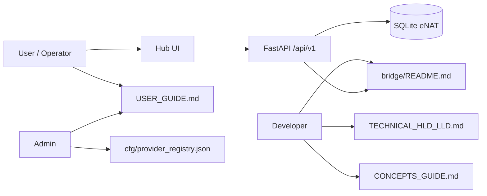

# BAIC Documentation Index


<!-- merit:cert-visibility:start -->
## MERIT certification (vault SSOT)

| Field | Value |
|-------|-------|
| **Project** | baic |
| **Certified** | no |
| **Level** | none |
| **Issued** | 2026-06-13 04:46:25 |
| **Roles** | — |

**Interlocks:** none registered.

Registry SSOT: `merit-private-vault/cfg/certification-registry.json` · interlocks: `cfg/interlock-registry.json` · program: `cfg/merit-certification-program.json`

Refresh: `python scripts/meritcert.py refresh-index` (from this repo) · operator steps: vault `docs/vault_usage.md` §3
<!-- merit:cert-visibility:end -->
<a id="index"></a>

**TokenMaxxing2Zero Control Plane** · baseline see [VERSION](../VERSION)

---

## Persona quick routes



| Persona | Start | Capabilities |
|---------|-------|--------------|
| **User** | [USER_GUIDE.md](USER_GUIDE.md) · `python run_baic.py` | Global Ledger, provider consoles, CTAs |
| **Admin** | [cfg/provider_registry.json](../cfg/provider_registry.json) · [PRD §6](input/BAIC_PRD.md#provider-registry) | Add providers, hierarchy chains, enable/disable |
| **Developer** | [TECHNICAL_HLD_LLD.md](TECHNICAL_HLD_LLD.md) · [bridge/](../bridge/README.md) | Bridges, DB port, API, tests |

---

## Document map

| Doc | Purpose |
|-----|---------|
| [USER_GUIDE.md](USER_GUIDE.md) | Operator workflows + UI tour |
| [TECHNICAL_HLD_LLD.md](TECHNICAL_HLD_LLD.md) | ER, OID, flows, API, modular DB |
| [CONCEPTS_GUIDE.md](CONCEPTS_GUIDE.md) | Concepts + superscript refs + bibliography |
| [input/BAIC_PRD.md](input/BAIC_PRD.md) | Unified PRD/HLD/LLD + UX |
| [BOOTSTRAPPING.md](BOOTSTRAPPING.md) | Git / merit.ps1 lifecycle |
| [COMPLETION_REPORT.md](COMPLETION_REPORT.md) | Alpha implementation sign-off |
| [BAIC_theme.md](BAIC_theme.md) | Brand voice |

---

## Run commands

```powershell
python -m pip install -r requirements.txt
cd web; npm install; npm run build; cd ..
python run_baic.py --no-browser
python test_baic.py
python -m ruff check core bridge db tests run_baic.py test_baic.py
```

Open **http://127.0.0.1:8765/** after `run_baic.py` (serves built UI + API).

---

## MERIT hyperlinks

Internal sections use [MERIT Hyperlink](CONCEPTS_GUIDE.md#merit-hyperlink) pattern. Example: [Hub-and-Spoke UX](input/BAIC_PRD.md#ux-input) [[input/BAIC_PRD#^ux-input|(obsidian)]]

---

## Obsidian

When using Obsidian, open **`BAIC docs/`** as the vault root (MERIT `{Name} docs/` pattern — unique repo prefix for multi-repo indexes).
