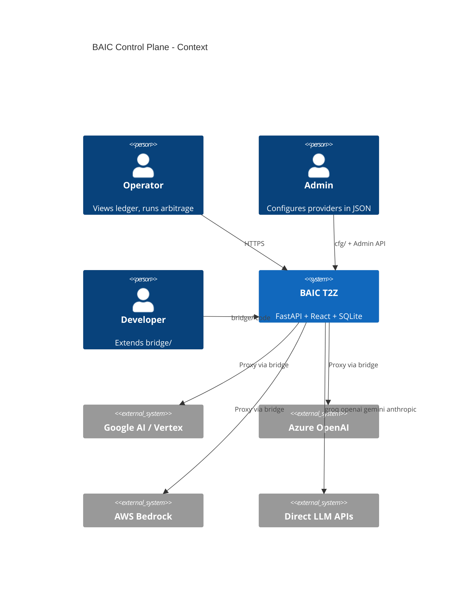
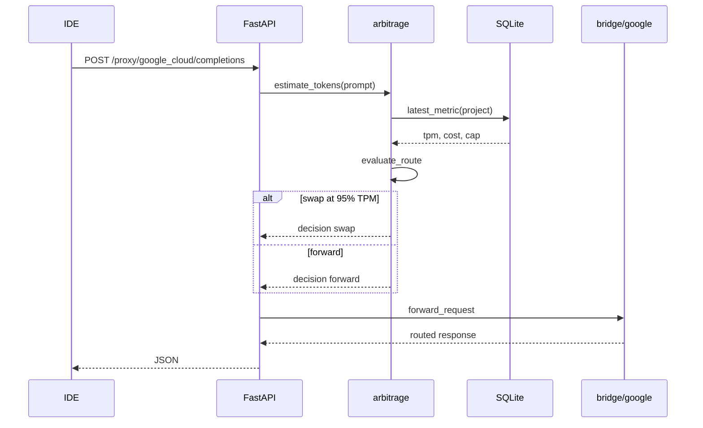
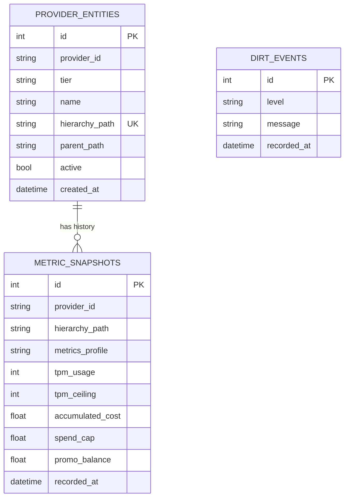

<a id="contents"></a>
# baic_design.md ^contents

Wave 6 3-doc SSOT. Legacy: `.archive/docs/`.

Cross-repo handoffs: [IAR/](IAR/) per MERIT §0.D.

---

# BAIC Technical HLD / LLD

Architecture reference with diagrams. Product requirements: [BAIC_PRD.md](input/BAIC_PRD.md). Operator guide: [baic_usage.md](baic_usage.md). Concepts: [.archive/docs/CONCEPTS_GUIDE.md](../.archive/docs/CONCEPTS_GUIDE.md).

---

## 1. System context (OID)



---

## 2. Container diagram

```mermaid
flowchart TB
  subgraph UI["web/ React + Tailwind + Recharts"]
    HUB[Global Ledger Hub]
    SPOKE[Provider Console]
  end
  subgraph API["core/api FastAPI"]
    R1[/hub/summary]
    R2[/providers/id/console]
    R3[/proxy/id/completions]
  end
  subgraph CORE["core/"]
    HS[hub_service]
    ARB[arbitrage]
    PL[provider_loader]
  end
  subgraph DBL["db/ modular"]
    PORT[DatabasePort]
    SQL[SQLiteBackend]
    REPO[EnatRepository]
  end
  subgraph BR["bridge/"]
    G[google]
    AZ[azure]
    OTH[aws, oci, cursor, ...]
    LLM[groq, openai, gemini, anthropic]
  end
  CFG[(cfg/*.json)]
  ENV[(.env.local L3)]
  HB[(HumanBala/env L2)]
  SQLITE[(output/baic_state.db)]

  HUB --> R1
  SPOKE --> R2
  R1 --> HS
  R2 --> HS
  R3 --> ARB
  HS --> PL
  HS --> REPO
  PL --> BR
  PL --> CFG
  PL --> ENV
  ENV --> HB
  REPO --> PORT
  PORT --> SQL
  SQL --> SQLITE
  ARB --> PL
```

---

## 3. Request flow (proxy path)



---

## 4. ER diagram (eNAT)



---

## 5. Modular database layer

| Layer | File | Responsibility |
|-------|------|----------------|
| Port | `db/ports.py` | Abstract `DatabasePort` |
| SQLite | `db/sqlite_backend.py` | Local file DB (default) |
| Models | `db/models.py` | SQLAlchemy ORM |
| Repository | `db/repository.py` | Query API for services |
| Factory | `create_database()` in sqlite_backend | Select engine from cfg |

**Migration path:** set `cfg/config.json` → `"engine": "postgres"` and implement `PostgresBackend(DatabasePort)` — `core/hub_service.py` unchanged.

**WebHostingPad:** SQLite file under `output/baic_state.db` requires writable `output/` — same pattern as local dev.

---

## 6. API reference

| Method | Path | Description |
|--------|------|-------------|
| GET | `/api/v1/health` | Health + DB status |
| GET | `/api/v1/hub/summary` | Global Ledger payload |
| GET | `/api/v1/providers/{id}/console` | Spoke console |
| POST | `/api/v1/providers/{id}/operations/{op}` | UI CTA handler |
| POST | `/api/v1/proxy/{id}/completions` | Inference proxy |
| GET | `/api/v1/admin/providers` | Registry + loaded ids |

Static UI: `/` when `web/dist/` exists (built).

---

## 7. Provider registry (11 providers)

| Kind | IDs | Hierarchy |
|------|-----|-----------|
| **hyperscaler** | `google_cloud`, `microsoft_azure`, `amazon_aws`, `oracle_oci` | billing → project → byok (OCI: compartment → compute_pool) |
| **consumer_frontend** | `cursor_pro`, `github_copilot`, `google_one_ai` | subscription → seat/credit_pool → routing_profile |
| **llm_api** | `groq`, `openai`, `gemini`, `anthropic` | `byok` only — direct API keys (mirrors `dirt/cfg/llm_providers.json`) |

SSOT: `cfg/provider_registry.json` · bridges: `bridge/llm_api.py` + thin stubs · spoke: `LLM_API_CONSOLE`.

---

## 8. Layered secrets (MERIT env chain)

Precedence: **L2 persona** (`HumanBala/env/<Persona>/.env.local`) → **L3 repo** (`.env.local`, repo wins).

| Layer | Loader |
|-------|--------|
| Python | `HumanBala/lib/merit_env.py` via `core/merit_env.py` |
| PowerShell | `HumanBala/scripts/Import-MeritEnv.ps1` |
| BAIC startup | `core/config_loader.load_merged_provider_secrets()` |

Detail: [IAR/MERITUTILS_ENV.md](IAR/MERITUTILS_ENV.md) · example keys: `.env.local.example`.

---

<a id="merit-workbench"></a>
## 9. MERIT HND / `merit_workbench` (planned)

Per MERIT L1 §II.E.1, staged operator surfaces use **grid + inspector** in the **center column**. X-Ray (§II.H) stays on the right rail.

| BAIC surface | HND mode | Status |
|--------------|----------|--------|
| Admin provider registry | `workbench` | **BLOCKED** — wait meritutils `merit_workbench` |
| eNAT entity browser | `workbench` | **BLOCKED** |
| LLM API model list (Spoke) | `readonly` | **BLOCKED** |
| Capability matrix admin | `readonly` | **BLOCKED** |
| Hub cards / Spoke gauges | not HND | **shipped** |

**Do not fork** grid/inspector DOM in `web/`. Implement thin React adapters after **BAI-MTU-01…08** ACCEPT.

Requirements SSOT: [IAR/MERITUTILS_WORKBENCH.md](IAR/MERITUTILS_WORKBENCH.md) · reference: DIRT `workbench-kit.*` → meritutils **`merit_workbench`** (not `@meritutils/hnd`).

---

## 10. Test harness

| Suite | File | Count |
|-------|------|-------|
| Unit | `tests/test_*.py` | path, config, db, bridge, arbitrage |
| Integration | `tests/test_api_integration.py` | FastAPI TestClient |
| Runner | `python test_baic.py` | wraps pytest |

**Last run:** 40 passed · ruff clean.

---

## 11. Persona x capability matrix

| Capability | User | Admin | Developer |
|------------|:----:|:-----:|:---------:|
| View Hub / Spoke | yes | yes | yes |
| Trigger CTAs | yes | yes | yes |
| Edit provider_registry.json | | yes | yes |
| Add bridge module | | | yes |
| Change DB backend | | | yes |
| Run test_baic.py | | yes | yes |
| Admin HND workbench | | future | yes |

---

## 12. Directory map

`
BAIC/
├── run_baic.py          # Operations entry
├── test_baic.py         # Test entry
├── core/                # hub_service, arbitrage, api, merit_env, provider_loader
├── db/                  # Modular persistence
├── bridge/<provider>/   # Vendor adapters (+ llm_api stubs)
├── cfg/                 # SSOT JSON
├── web/                 # React UI -> dist/
├── tests/               # pytest
└── BAIC docs/           # design + usage + IAR/
`

See [INDEX.md](INDEX.md) for navigation.
