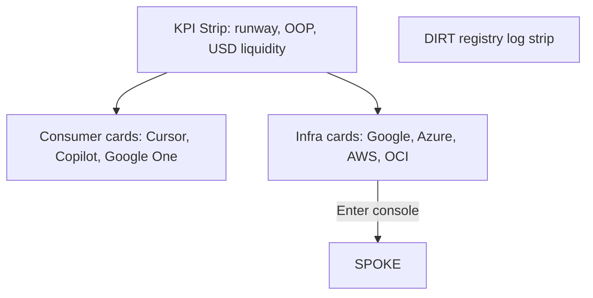

<a id="contents"></a>
# baic_usage.md ^contents

Wave 6 3-doc SSOT.`n
---

# BAIC User Guide

Operator guide for the TokenMaxxing Control Plane. Architecture: [../.archive/docs/TECHNICAL_HLD_LLD.md](../.archive/docs/TECHNICAL_HLD_LLD.md).

---

## Quick start

```powershell
python -m pip install -r requirements.txt
cd web; npm install; npm run build; cd ..
python run_baic.py
```

Browser opens **http://127.0.0.1:8765/** (API + UI on one port).

---

## UI tour

### Global Ledger (Hub)



| Section | Action |
|---------|--------|
| Consumer card | Click CTA (e.g. Troubleshoot Sync) |
| Infra card | **Enter console** → Spoke |
| DIRT strip | Read-only system events |

### Google Spoke (example)

- **Block A** — AI Studio projects, TPM ceiling, 2026 pricing matrix  
- **Block B** — Vertex promo pools, guardrails, swap ops  
- **Cost gauge** — Recharts bar vs $15 hard cap  

**Back to Hub** link top-left.

---

## Personas

| Role | You need |
|------|----------|
| **User** | This guide + running `run_baic.py` |
| **Admin** | [provider_registry.json](../cfg/provider_registry.json) + [PRD §6](input/BAIC_PRD.md#provider-registry) |
| **Developer** | [bridge/README.md](../bridge/README.md) + [TECHNICAL](../.archive/docs/TECHNICAL_HLD_LLD.md) |

---

## Admin: add a provider (no code)

1. Copy fields from [provider_registry.example.json](../cfg/provider_registry.example.json)  
2. Set `hierarchy[]` if not default `billing_account → project → byok`  
3. Point `bridge_module` at existing or new `bridge.<name>`  
4. Restart `run_baic.py`  
5. Closeout with `merit.ps1 mXin`

---

## Troubleshooting

| Symptom | Fix |
|---------|-----|
| Blank UI | Run `cd web && npm run build` |
| API error on Hub | Delete `output/baic_state.db` and restart (re-seeds demo) |
| Port in use | Change `cfg/config.json` → `api_port` |

---

## Concepts

- [Hub-and-Spoke](../.archive/docs/CONCEPTS_GUIDE.md#hub-and-spoke)  
- [Metrics profile](../.archive/docs/CONCEPTS_GUIDE.md#metrics-profile) — USD vs compute vs allowance  
- [Quota swap](../.archive/docs/CONCEPTS_GUIDE.md#quota-swap)  

---

MERIT closeout: `.\scripts\merit.ps1 mXin` after doc or cfg changes.

