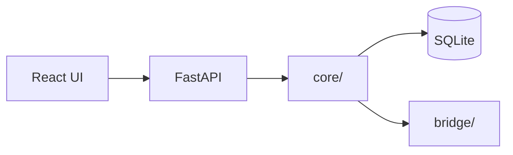

# README

## Welcome to the TokenMaxxing2Zero Tracker (T2Z)!

**BAIC Control Plane** — Hub-and-Spoke UI for multi-cloud token arbitrage, quota routing, and provider management.

## Quick start (3 commands)

```powershell
python -m pip install -r requirements.txt
cd web; npm install; npm run build; cd ..
python run_baic.py
```

Open **http://127.0.0.1:8765/** · Tests: `python test_baic.py` (22 tests)

## Getting Started

Full setup and git workflow: **[Bootstrapping Guide](BAIC%20docs/BOOTSTRAPPING.md)**

### Operator script (single entry point)

| Command | When to use |
|---------|-------------|
| `python run_baic.py` | Start control plane (API + UI) |
| `python test_baic.py` | Run all unit + integration tests |
| `.\scripts\merit.ps1 bootstrap` | First-time Git + GitHub setup |
| `.\scripts\merit.ps1 mXout -Path <file>` | Lock path and pull |
| `.\scripts\merit.ps1 mXin` | Commit, tag, push, release locks |
| `.\scripts\merit.ps1 release` | VERSION bump (patch/minor/major) |

## Documentation

| Document | Description |
|----------|-------------|
| [BAIC docs/INDEX.md](BAIC%20docs/INDEX.md) | **Start here** — persona routes + diagram |
| [USER_GUIDE.md](BAIC%20docs/USER_GUIDE.md) | Operator UI tour |
| [TECHNICAL_HLD_LLD.md](BAIC%20docs/TECHNICAL_HLD_LLD.md) | ER, OID, API, modular DB |
| [CONCEPTS_GUIDE.md](BAIC%20docs/CONCEPTS_GUIDE.md) | Concepts + bibliography |
| [COMPLETION_REPORT.md](BAIC%20docs/COMPLETION_REPORT.md) | Alpha implementation sign-off |
| [PRD / HLD / LLD](BAIC%20docs/input/BAIC_PRD.md) | Product requirements |
| [AGENTS.md](AGENTS.md) | Cursor agent bootstrap |

## Project Structure

```
BAIC/
├── run_baic.py             # Main entry (operations)
├── test_baic.py            # Test entry (unified test runner)
├── core/                   # Arbitrage, API, hub service
├── db/                     # Modular DatabasePort → SQLite
├── bridge/<provider>/      # Per-vendor integration
├── web/                    # React Hub + Spoke UI
├── cfg/                    # config.json, provider_registry.json
├── tests/                  # pytest harness
├── scripts/merit.ps1       # Git lifecycle
└── BAIC docs/              # INDEX, guides, diagrams (MERIT {Name} docs/)
```

## Architecture (at a glance)



See [TECHNICAL_HLD_LLD.md](BAIC%20docs/TECHNICAL_HLD_LLD.md) for full diagrams.
